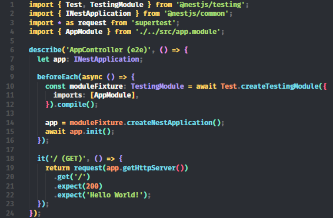

# OpenSpace Theme
  * A dark theme for [Visual Studio Code](https://code.visualstudio.com/).
  * Demo  

    

# Installation
  1. Install the [OpenSpace Theme](https://marketplace.visualstudio.com/items?itemName=OpenSpace.openspace-theme) from the Marketplace.
  2. Open the command palette `(Ctrl/Cmd + Shift + P)` and search for `Preferences: Color Theme`.
  3. Select `OpenSpace Theme`.

# Release Notes
  * For full release notes, see [the changelog](https://github.com/hunqng/openspace-theme/blob/main/docs/CHANGELOG.md).

# License
  * [MIT License](https://github.com/hunqng/openspace-theme/blob/main/LICENSE).

**Enjoy!**
